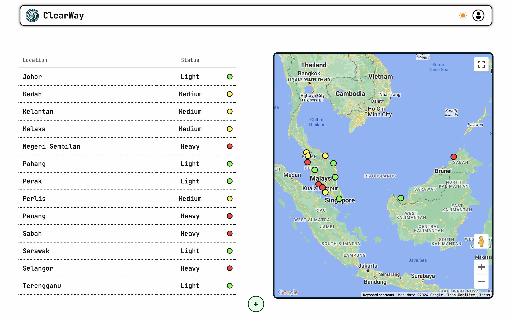
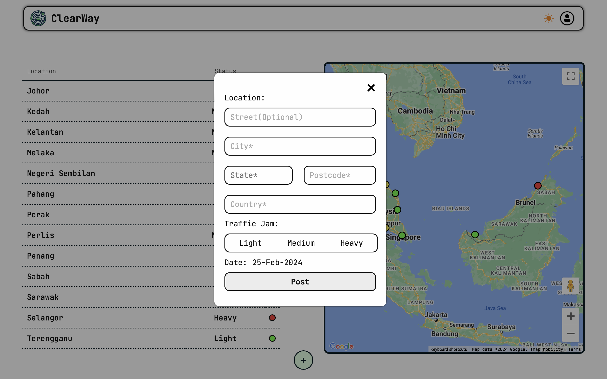
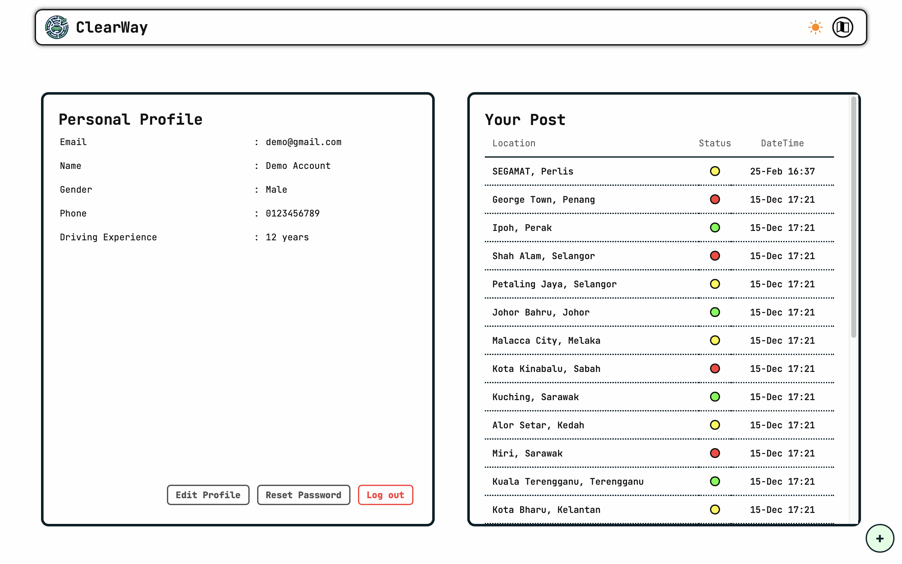
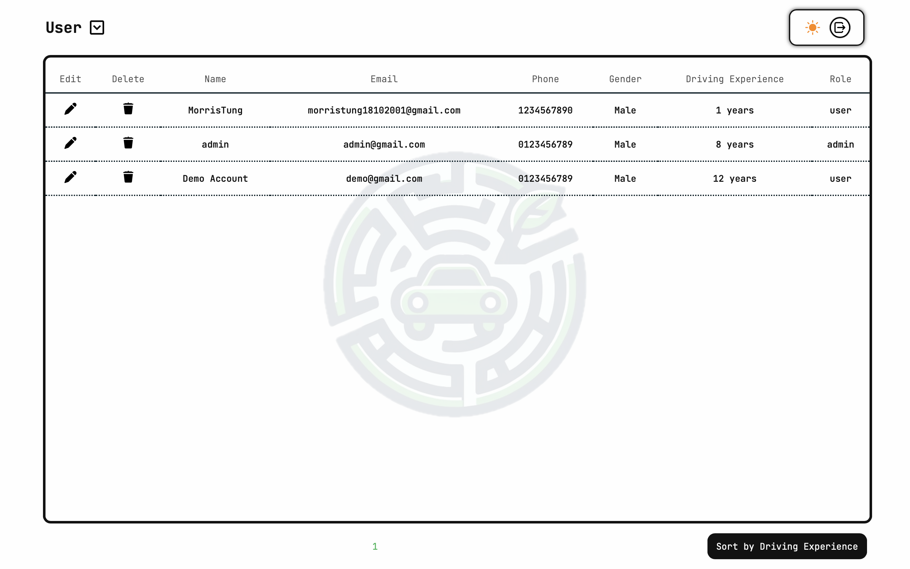

<p align="center">
  
</p>

# ClearWay

ClearWay is a web platform designed to enhance traffic management and sustainability by facilitating community-shared, real-time traffic updates.

## Features ✨

* **😀 User Registration and Login**: Secure access to personal accounts.
* **🚦 Real-Time Traffic Updates**: Users can post and view traffic statuses to improve commuting decisions.
* **🔒 Password Management**: Features for password recovery and updates.
* **✏️ Admin Dashboard**: For managing users and posts data effectively.
* **💻 Responsive Design**: Ensures a great user experience across every devices.


## Technologies Used

* **Frontend** : HTML, CSS, JavaScript
* **Backend** : PHP, MySQL
* **Email Verification** : PHPMailer for secure email verification processes.
* **APIs** : Google Maps for displaying traffic statuses geographically.


## Demo
<div align="center">
  
  <p align="center">Landing Page</p>
  
  <p align="center">Home Page</p>
  
  <p align="center">Traffic Data Dialog</p>
  
  <p align="center">Profile Page</p>
  
  <p align="center">Admin Portal</p>
</div>


## Installation

Before you run, you need to do some settings and configuration:

1. All the code should locate at the XAMPP folder: `/htdocs/WEB2202/ClearWay/`
2. Create a new database in XAMPP called `clearway`, then insert the `clearway.sql`
3. Set up the send email feature:

   * Go to `/app/send_email.php` and replace some value:
     * `<REPLACE_YOUR_GMAIL_SMTP_EMAIL_HERE>` * 2

       ```php
       $mail->Username   = '<REPLACE_YOUR_GMAIL_SMTP_EMAIL_HERE>';
       ```

       ```php
       $mail->setFrom('<REPLACE_YOUR_GMAIL_SMTP_EMAIL_HERE>', 'ClearWay');
       ```
     * `<REPLACE_YOUR_GMAIL_SMTP_PASSWORD_HERE>`

       ```php
       $mail->Password   = '<REPLACE_YOUR_GMAIL_SMTP_PASSWORD_HERE>';
       ```
     * `<REPLACE_YOUR_PHPMailer_PATH_HERE>` * 3

       ```php
       require '<REPLACE_YOUR_PHPMailer_PATH_HERE>/PHPMailer/src/Exception.php';
       require '<REPLACE_YOUR_PHPMailer_PATH_HERE>/PHPMailer/src/PHPMailer.php';
       require '<REPLACE_YOUR_PHPMailer_PATH_HERE>/PHPMailer/src/SMTP.php';
       ```

To access the admin feature in ClearWay please login with email `admin@gmail.com` and password `12345678`.

# Reference

* To get your Gmail SMTP password: [Google Account Help: Sign in with app passwords](https://support.google.com/accounts/answer/185833?hl=en)
* How to install PHPMailer: [PHPMailer]()
